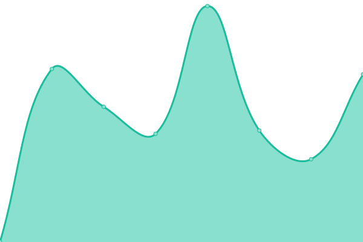

# [📈 Live Status](https://demo.upptime.js.org): <!--live status--> **🟧 Partial outage**

<!--start: status pages-->
<!-- This summary is generated by Upptime (https://github.com/upptime/upptime) -->
<!-- Do not edit this manually, your changes will be overwritten -->
<!-- prettier-ignore -->
| URL | Status | History | Response Time | Uptime |
| --- | ------ | ------- | ------------- | ------ |
|  [Nodo](https://www.101si.com.ar/) | 🟩 Up | [nodo.yml](https://github.com/juanLabonia/uptime/commits/HEAD/history/nodo.yml) | 

 1072ms
     
 | 

<a href="https://demo.upptime.js.org/history/nodo">100.00%</a>
    

|  [Ofishop](https://ofishop.com/) | 🟥 Down | [ofishop.yml](https://github.com/juanLabonia/uptime/commits/HEAD/history/ofishop.yml) | 

 0ms
     
 | 

<a href="https://demo.upptime.js.org/history/ofishop">0.00%</a>
    

|  [EDGAR](https://www.edgar.com.ar/) | 🟥 Down | [edgar.yml](https://github.com/juanLabonia/uptime/commits/HEAD/history/edgar.yml) | 

 218ms
     
 | 

<a href="https://demo.upptime.js.org/history/edgar">0.00%</a>
    

|  [ARBA COT](https://cot.arba.gov.ar/TransporteBienes/SeguridadCliente/presentarRemitos.do) | 🟩 Up | [arba-cot.yml](https://github.com/juanLabonia/uptime/commits/HEAD/history/arba-cot.yml) | 

 960ms
     
 | 

<a href="https://demo.upptime.js.org/history/arba-cot">100.00%</a>
    

|  [Tango](https://tiendas.axoft.com/api/Aperture/dummy) | 🟩 Up | [tango.yml](https://github.com/juanLabonia/uptime/commits/HEAD/history/tango.yml) | 

 641ms
     
 | 

<a href="https://demo.upptime.js.org/history/tango">100.00%</a>
    

|  [C.P.G.S.M.](http://cpgsm.101si.com.ar:8001) | 🟥 Down | [c-p-g-s-m.yml](https://github.com/juanLabonia/uptime/commits/HEAD/history/c-p-g-s-m.yml) | 

 0ms
     
 | 

<a href="https://demo.upptime.js.org/history/c-p-g-s-m">0.00%</a>
    

<!--end: status pages-->

[**Visite nuestro sitio web →**](https://www.101si.com.ar/)

## 📄 License

- Powered by: [Upptime](https://github.com/upptime/upptime)
- Code: [MIT](./LICENSE) © [Juan Labonia](https://www2.101si.com.ar)
- Data in the `./history` directory: [Open Database License](https://opendatacommons.org/licenses/odbl/1-0/)
